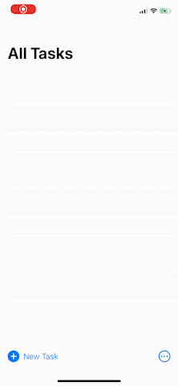
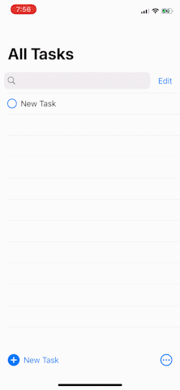
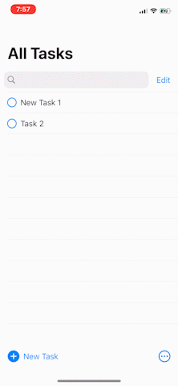
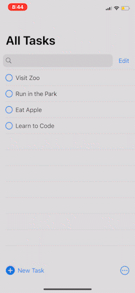
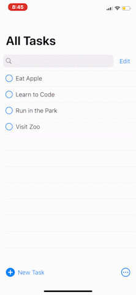
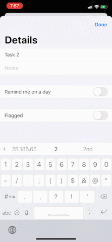
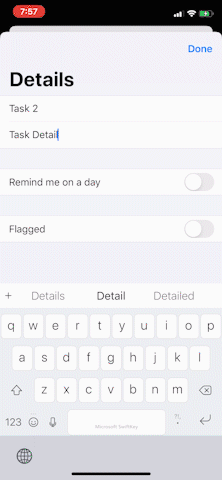
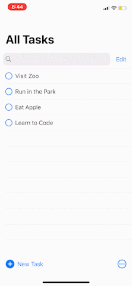

# Task

This is To-Do List app developed with SwiftUI and Xcode.

Current working features include:

- Add new list item feature

- Edit item details feature

- Delete list item feature

- Re-arrange list item feature

- Sorting feature

- Filter feature

- Search feature

- Flag list item feature

- Notification feature

- Dark mode

# Requirement

- Xcode 12
- Swift 5.0
